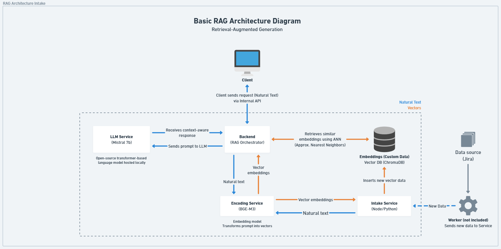

# LLM Tool to size agile story points
This tool uses RAG architecture with open-source mistral 7B to store agile stories in a vector database and then use them as a reference when requesting to size a new story.



Feel free to send a PR and collaborate to this project if you feel like it.

Thanks, <br />Luis

## Dependencies
- Nvidia card with 16GB VRAM and nvidia/cuda:12.1.0-runtime-ubuntu20.04
- Linux libraries:
    - nvidia-smi
    - huggingface_hub
- Python 3 and pip package manager
- Install libraries:
    - transformers
    - accelerate
    - uvicorn
    - fastapi
    - requests
    - sentence-transformers
    - chromadb
    - python-multipart
- Get Mistral LLM:
    - Log in or create an account in huggingface.co
    - Download Mistral instruct v0.3 [here](https://huggingface.co/mistralai/Mistral-7B-Instruct-v0.3).
    - Create token, copy it and paste it in `./llm_service/llm_service.py:line 23`

## Running locally:
CD into each folder and run the services as follow:
- llm_service: `uvicorn llm_service:app --host 0.0.0.0 --port 8005 --reload`
- vector_db: `uvicorn vector_db_service:app --host 0.0.0.0 --port 8000 --reload`
- intake_service (Just for inserting records): `uvicorn intake_service:app --host 0.0.0.0 --port 8001 --reload`
- backend: `uvicorn backend:app --host 0.0.0.0 --port 8002 --reload`
- encoding_service: `uvicorn encoding_service:app --host 0.0.0.0 --port 8004 --reload`

To insert a record use postman or similar tool and create the following request:

Endpoint: `POST - localhost:8001/add`

Body:
```json
{
  "doc_id": "JIRA-133",
  "text": "The shopping cart sometimes displays an incorrect total when items are added or removed quickly. Steps to Reproduce: 1. Add multiple items to the cart. 2. Rapidly remove and add items. 3. Notice the total does not update correctly. Expected Behavior: - The total should always reflect the current items in the cart. Priority: Critical Story Points: 8 Labels: cart, bug, urgent Components: frontend, backend Assignee: oliver_smith Created: 2024-02-14 Updated: 2024-02-22 Status: In Progress"
}
```

To request assessment of ticket in story points:

Endpoint: `localhost:8002/rag`

Body:
```json
{
    "query": "As a user, I want the right profile name to be displayed. Currently the wrong name is being displayed Acceptance Criteria: - When I load the profile page, the right name shows up. Labels: profile, wrong data Components: frontend Assignee: Neo Created: 2024-02-11 Updated: 2024-02-20 Status: Backlog"
}
```